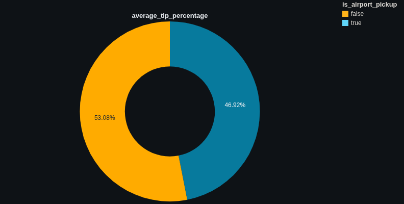
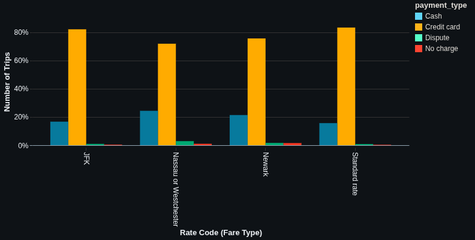
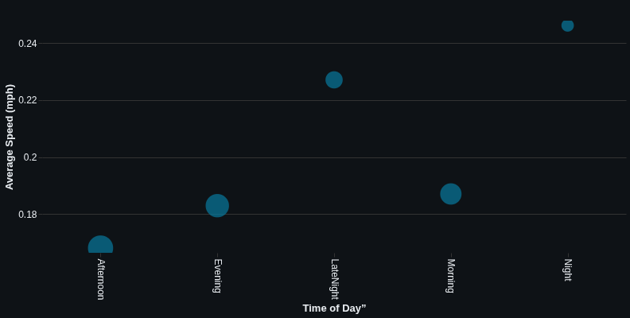
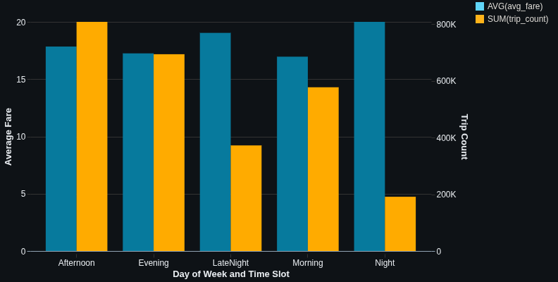
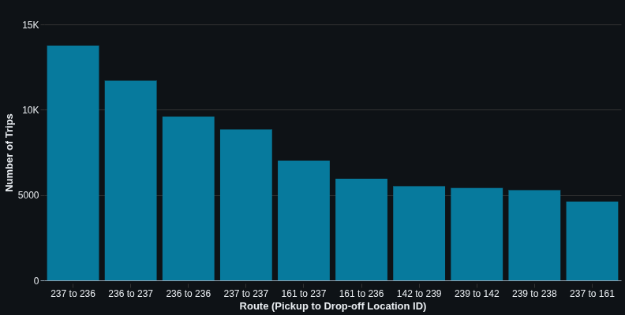

# New York Taxi ETL: Week 2 Project Report

## Introduction

This report details my end-to-end ETL process for the NYC Yellow Taxi January 2024 dataset, following the assignment's structure and objectives. I worked through each stage of the ETL pipeline, from data ingestion and profiling to cleaning, transformation, and analysis, using Databricks and PySpark.

While working on this project, I encountered some platform limitations: I didn't have permissions to create an Azure storage account, and my Databricks trial expired before I could finish, so I switched to serverless compute. As a result, I wasn't able to use the Hive metastore or run SQL for the final analysis. Instead, I completed all steps using Python and Spark DataFrames, making sure to address each task's requirements as fully as possible.

---

## Task 1: Data Ingestion, Environment Preparation, and Initial Exploration

### 1.1 Download and Understand the Dataset & Dictionary

- **Dataset:** [yellow_tripdata_2024-01.parquet](https://d37ci6vzurychx.cloudfront.net/trip-data/yellow_tripdata_2024-01.parquet)
- **Data Dictionary:** Downloaded and reviewed from the TLC website.

**Key Columns for ETL & Business Analysis:**
- `tpep_pickup_datetime`, `tpep_dropoff_datetime`: Trip timing, essential for duration and time-based analysis.
- `PULocationID`, `DOLocationID`: Pickup/drop-off zones, critical for route and spatial analysis.
- `passenger_count`: For demand and occupancy analysis.
- `trip_distance`: Core for distance, speed, and fare calculations.
- `fare_amount`, `total_amount`, `tip_amount`: For revenue, tip, and fare structure analysis.
- `payment_type`, `RatecodeID`: Coded values, important for understanding payment trends and fare rules.

**Coded Values (from dictionary):**
- `RatecodeID`: 1=Standard, 2=JFK, 3=Newark, 4=Nassau/Westchester, etc.
- `payment_type`: 1=Credit card, 2=Cash, 3=No charge, 4=Dispute, etc.

**Initial Data Type & Quality Thoughts:**
- Many columns are numeric but may be loaded as strings (e.g., `passenger_count`).
- Timestamps must be parsed correctly.
- Expect possible nulls, outliers (e.g., negative fares), and code values outside the dictionary.

### 1.2 Azure Storage & Data Upload

I planned to use Azure Blob Storage or ADLS Gen2, but I couldn't create a storage account due to permissions. So, I worked with local files and Databricks' built-in storage for this exercise.

### 1.3 Cluster Configuration

Because the dataset is ~50-100MB for one month, I used a simple configuration:

- Worker Type: Standard_D4pds_v6 (16 GB Memory, 4 Cores)
- Autoscaling: Enabled (Min Workers: 1, Max Workers: 1)
- Driver Type: Same as Worker (Standard_D4pds_v6)
- Photon Acceleration: Enabled
- Auto Termination: 10 minutes of inactivity
- Databricks Runtime Version: 16.4 LTS (includes Apache Spark 3.5.2, Scala 2.13)


When my trial expired, I switched 
to serverless compute. This was enough for the workload, but I lost 
access to the Hive metastore and some advanced features.

### 1.4 Notebook & Data Loading

I created a new Databricks notebook and loaded the Parquet file into a Spark DataFrame:

```python
raw_taxi_df = spark.read.parquet("/FileStore/tables/yellow_tripdata_2024_01.parquet") 
```

### 1.5 Initial Data Profiling and Understanding

I started with simple data understanding methods like checking the schema, the row counts and so on. These are some of the findings from my analysis:

- **Schema & Dictionary Alignment**

    The dataset's column names, data types, and value domains mostly match the official TLC data dictionary. There are some minor differences due to Spark's defaults: for example, some integer fields are loaded as `long` (bigint), and timestamps use the `timestamp_ntz` type. Overall, the schema is consistent with the data dictionary and suitable for analysis after minor type adjustments.

- **Dataset Size**

    We have 2,964,624 trip records for January 2024—ample volume for robust downstream analysis.

- **Descriptive Statistics**

    Running df.describe().show() surfaced an unexpected outlier:

    1.  **Missing Values**: Columns such as `passenger_count`, `RatecodeID`, `store_and_fwd_flag`, `congestion_surcharge`, and `Airport_fee` have fewer rows (2,824,462) than other columns (2,964,624), indicating approximately 140,162 missing values (4.73% of total rows), consistent with the null elements analysis.
    2. **Data Variability**:
   - `trip_distance` exhibits extreme variability, with a standard deviation of 225.46 and a maximum value of 312,722.3, suggesting potential outliers or data entry errors.
   - `fare_amount` and `total_amount` show large ranges (-899.0 to 5,000.0 and -900.0 to 5,000.0, respectively), with negative values indicating possible refunds or data issues.
   - `RatecodeID` has a high standard deviation (9.82) and a maximum of 99, which may reflect non-standard or erroneous rate codes.
    3. **Categorical Columns**:
   - `VendorID`, `payment_type`, and `store_and_fwd_flag` have low variability, with 3, 5, and 2 distinct values, respectively, indicating limited categories.
   - `PULocationID` and `DOLocationID` range from 1 to 265, reflecting a large but finite set of pickup and drop-off locations.
    4. **Monetary Columns**: Columns like `fare_amount`, `tip_amount`, `tolls_amount`, and `total_amount` show negative minimum values, which may indicate data quality issues or specific business cases (e.g., refunds or adjustments).
   - `tip_amount` (mean 3.34, max 428.0) suggest right-skewed distributions, with most values being low but some extreme outliers.

- **Anomalies Detected: Negative Monetary Values**

   I checked for negative values in fields that should only be additive charges. The results:

    | Column                | # Negative Rows | % of Total Rows |
    |-----------------------|-----------------|-----------------|
    | fare_amount           | 37,448          | 1.26%           |
    | extra                 | 17,548          | 0.59%           |
    | mta_tax               | 34,434          | 1.16%           |
    | tip_amount            | 102             | 0.00%           |
    | tolls_amount          | 2,035           | 0.07%           |
    | improvement_surcharge | 35,502          | 1.20%           |
    | total_amount          | 35,504          | 1.20%           |
    | congestion_surcharge  | 28,825          | 0.97%           |
    | airport_fee           | 4,921           | 0.17%           |

    These negative values are not expected in normal trip records and likely indicate post-trip reversals, disputes, or data errors.

-  **Null Elements Analysis**

    An analysis was conducted to identify null values across the dataset's columns. The results are summarized in the table below:

    | Column                | # Null Rows | % of Total Rows |
    |-----------------------|-------------|-----------------|
    | passenger_count       | 140,162     | 4.73%           |
    | RatecodeID            | 140,162     | 4.73%           |
    | store_and_fwd_flag    | 140,162     | 4.73%           |
    | congestion_surcharge  | 140,162     | 4.73%           |
    | Airport_fee           | 140,162     | 4.73%           |

    Notably, all listed columns exhibit the same number of null values (140,162), representing 4.73% of the total rows. This observation suggests a potential correlation where a null value in one column implies null values in the others.

    To verify this, a filter was applied to isolate rows where `store_and_fwd_flag` is null:

    ```python
    null_store = df.filter(col("store_and_fwd_flag").isNull())
    ```

    Subsequently, the null counts for the other columns were checked within this filtered dataset:

    ```python
    null_store.select([
    count(when(col(c).isNull(), 1)).alias(c)
    for c in ["passenger_count", "RatecodeID", "congestion_surcharge", "Airport_fee"]
    ]).show()
    ```
    The results confirmed that each of the other columns also had 140,162 null values in the filtered dataset, indicating that null values occur simultaneously across these columns.

- **Distinct Elements Analysis**

    An analysis was performed to determine the number of unique values (distinct elements) for each column in the dataset. The results are summarized in the table below:

    | Column                | # Distinct Elements |
    |-----------------------|---------------------|
    | VendorID              | 3                   |
    | tpep_pickup_datetime  | 1,575,706           |
    | tpep_dropoff_datetime | 1,574,780           |
    | passenger_count       | 10                  |
    | trip_distance         | 4,489               |
    | RatecodeID            | 7                   |
    | store_and_fwd_flag    | 2                   |
    | PULocationID          | 260                 |
    | DOLocationID          | 261                 |
    | payment_type          | 5                   |
    | fare_amount           | 8,970               |
    | extra                 | 48                  |
    | mta_tax               | 8                   |
    | tip_amount            | 4,192               |
    | tolls_amount          | 1,127               |
    | improvement_surcharge | 5                   |
    | total_amount          | 19,241              |
    | congestion_surcharge  | 6                   |
    | Airport_fee           | 3                   |

    This analysis highlights the variability of values within each column. Notably, columns such as `tpep_pickup_datetime` and `tpep_dropoff_datetime` have a high number of distinct elements (1,575,706 and 1,574,780, respectively), indicating a wide range of unique timestamps. In contrast, columns like `VendorID`, `store_and_fwd_flag`, and `Airport_fee` have very few distinct values (3, 2, and 3, respectively), suggesting limited variability. The high number of unique values in columns like `total_amount` (19,241) and `fare_amount` (8,970) reflects the diverse range of monetary values in the dataset.

---

## Task 2: Data Cleaning, Validation, and Transformation Strategy

### 2.1 Data Cleaning Strategy

Based on the initial profiling and the official TLC data dictionary, I identified several data quality issues and developed a targeted cleaning strategy. Below, I detail the main issues, the rationale for each cleaning step, and the specific actions taken.

---

**1. Trip Distance Outliers and Inconsistencies**

- **Issue:**  
  The `trip_distance` column exhibited extreme outliers (e.g., values over 300,000 miles) and a significant number of zero values. According to the data dictionary, this field should represent the actual miles traveled, and such values are not plausible for NYC taxi trips.
- **Action:**  
  - **Calculated the 99.9th percentile** for `trip_distance` to understand its distribution and identify a reasonable upper bound for realistic trips. The result was 29.51 miles.
  ```python
  raw_taxi_df.approxQuantile("trip_distance", [0.999], 0.0)[0]
  ```
  - **Created a new column, `time_take_min`**, representing trip duration in minutes, to cross-validate trip distance with time, which is essential for calculating speed.
  ```python
  raw_taxi_df = raw_taxi_df.withColumn("time_take_min", (unix_timestamp("tpep_dropoff_datetime") - unix_timestamp("tpep_pickup_datetime")) / 60.0)
  ```
  - **Filtered out trips with implausible average speeds** (over 50 mph). Given the nature of city taxi data, it is highly unlikely for a vehicle to maintain such a high speed for an extended duration.
  ```python
  df_valid_speed = raw_taxi_df.filter(
      (col("trip_distance") / (col("time_take_min")/60)) <= 50
  )
  ```
  - After validating speed, **filtered out remaining rows with `trip_distance` greater than 50 miles**, as these are still considered extreme outliers even after speed-based filtering.
- **Rationale:**  
  These steps ensure that only realistic taxi trips are retained, significantly improving the reliability of downstream analyses by removing physically impossible or highly erroneous records.

---

**2. Negative and Implausible Fare and Charge Values**

- **Issue:**  
  Several monetary columns (`fare_amount`, `total_amount`, `tip_amount`, etc.) contained negative values, which are not expected under normal circumstances according to the data dictionary. While some negative values may represent refunds or adjustments, many are likely data entry errors.
- **Action:**  
  - **Identified and filtered out a specific set of negative fare records**: those with negative fare, standard payment types (0, 1, 2: Flex Fare, Credit Card, Cash), and very short trip distances (less than 1 mile). These were deemed inconsistent with typical taxi operations.
  ```python
  df_valid_fare_first = df_clean.filter(
     ~ (
      (col("fare_amount") < 0) &
      (col("payment_type").isin(0, 1, 2)) &
      (col("trip_distance") < 1)
      )
  )
  ```
  - For the **remaining negative values in monetary columns**, if the `payment_type` indicated a standard transaction (0, 1, 2), I **converted them to positive** by multiplying by -1. This assumes data entry errors where a negative sign was mistakenly included for legitimate charges. This was applied to: `fare_amount`, `extra`, `mta_tax`, `tip_amount`, `tolls_amount`, `improvement_surcharge`, `total_amount`, `congestion_surcharge`, and `airport_fee`.
  ```python
  df_valid_fare_second = df_valid_fare_first.withColumn(
      "fare_amount",
      when(
          (col("fare_amount") < 0) &
          (col("payment_type").isin(0, 1, 2)),
          -col("fare_amount")
  ).otherwise(col("fare_amount"))
              
  ).withColumn(
      "extra",
      when(
          (col("extra") < 0) &
          (col("payment_type").isin(0, 1, 2)),
          -col("extra")
  ).otherwise(col("extra"))
              
  ).withColumn(
      "mta_tax",
      when(
          (col("mta_tax") < 0) &
          (col("payment_type").isin(0, 1, 2)),
           -col("mta_tax")
  ).otherwise(col("mta_tax"))

  ).withColumn(
      "tip_amount",
      when(
          (col("tip_amount") < 0) & 
          (col("payment_type").isin(0, 1, 2)),
          -col("tip_amount")
  ).otherwise(col("tip_amount"))

  ).withColumn(
      "tolls_amount",
      when(
          (col("tolls_amount") < 0) &
          (col("payment_type").isin(0, 1, 2)), 
          -col("tolls_amount")
  ).otherwise(col("tolls_amount"))

  ).withColumn(
      "improvement_surcharge",
      when(
          (col("improvement_surcharge") < 0) &
          (col("payment_type").isin(0, 1, 2)), 
          -col("improvement_surcharge")
  ).otherwise(col("improvement_surcharge"))

  ).withColumn(
      "total_amount",
      when(
          (col("total_amount") < 0) &
          (col("payment_type").isin(0, 1, 2)), 
          -col("total_amount")
  ).otherwise(col("total_amount"))
      
  ).withColumn(
      "congestion_surcharge",
      when(
          (col("congestion_surcharge") < 0) &
          (col("payment_type").isin(0, 1, 2)), 
          -col("congestion_surcharge")
  ).otherwise(col("congestion_surcharge"))

  ).withColumn(
      "airport_fee",
      when(
          (col("airport_fee") < 0) &
          (col("payment_type").isin(0, 1, 2)), 
          -col("airport_fee")
  ).otherwise(col("airport_fee"))
  )
  ```
- **Rationale:**  
  This approach aims to preserve legitimate refund/dispute records (which might have different payment types) while correcting likely data entry mistakes for standard transactions, aligning with the data dictionary's intent for these monetary fields.

---

**3. Trip Duration and Timestamp Corrections**

- **Issue:**  
  The calculated `time_take_min` column contained negative values, indicating that `tpep_pickup_datetime` occurred *after* `tpep_dropoff_datetime`. This suggests an interchange error in the source data.
- **Action:**  
  - Identified rows where `time_take_min` was negative.
  - For these specific rows, the values in `tpep_pickup_datetime` and `tpep_dropoff_datetime` were swapped to correct the chronological order.
- **Rationale:**  
  Ensures all trips have a positive and logically correct duration, which is a fundamental requirement for accurate trip records and subsequent time-based analysis.

---

**4. Zero Trip Distance: Business Logic for Retention or Removal**

- **Issue:**  
  Trips with zero `trip_distance` can be ambiguous. While some may indicate valid scenarios like a flag drop or very short crawl, others could represent canceled trips or data errors.
- **Action:**  
  - Developed a comprehensive set of business rules to classify zero-distance trips as "keep" or "drop" by creating a `keep_or_drop` column, considering `time_take_min`, `fare_amount`, and `payment_type`:
  ```python
  df_clean = df_valid_distance.withColumn(
      "keep_or_drop",
      when(
          # 1) Flag-drop rides -> KEEP: Short duration, minimum fare, standard payment types.
          (col("trip_distance") == 0) &
          (col("time_take_min") < 2) &
          (col("fare_amount") >= 4.50) &
          (col("payment_type").isin(1, 2)),
          lit("keep")
      ).when(
          # 2) Rounding-artifact (short crawl) -> KEEP: Slightly longer duration for a "zero" distance trip, minimum fare, standard payment types.
          (col("trip_distance") == 0) &
          (col("time_take_min") >= 2) &
          (col("time_take_min") < 10) &
          (col("fare_amount") >= 4.50) &
          (col("payment_type").isin(1, 2)),
          lit("keep")
      ).when(
          # 3) Canceled / No-Charge / Voided -> DROP: Zero distance with payment types indicating no charge or void.
          (col("trip_distance") == 0) &
          (col("payment_type").isin(3, 4, 6)),
          lit("drop")
      ).when(
          # 4) Meter-glitch (>=10 min on meter, fare = 0) -> DROP: Long duration but no fare, suggesting a data error.
          (col("trip_distance") == 0) &
          (col("time_take_min") >= 10) &
          (col("fare_amount") == 0),
          lit("drop")
      ).when(
          # 5) High-fare, short-time anomaly -> DROP: High fare for a very short duration and zero distance.
          (col("trip_distance") == 0) &
          (col("time_take_min") < 5) &
          (col("fare_amount") > 20),
          lit("drop")
      ).otherwise(
          # 6) Everything else (including trip_distance > 0) -> KEEP
          lit("keep")
      )
  )
  ```
  - After applying this logic, the DataFrame was filtered to `keep` only the valid zero-distance trips and all trips with `trip_distance` greater than zero.
- **Rationale:**  
  This nuanced approach retains legitimate short trips (like flag drops) while accurately removing likely errors or non-service records, aligning with the operational realities of a taxi service.

---

**5. Fare Validation Against TLC Rules**

- **Issue:**  
  Despite cleaning negative values, some `fare_amount` entries might still be inconsistent with the official NYC Taxi & Limousine Commission (TLC) fare structure.
- **Action:**  
  - Calculated `distance_fare` and `time_fare` based on the documented rates.
  - Determined the `meter_increment` as the greater of `distance_fare` or `time_fare`, as per TLC rules.
  - Computed an `expected_meter_fare` based on `RatecodeID` and the specific fare rules for standard rates, JFK, Newark, and Nassau/Westchester.
  - Filtered out trips where the `fare_amount` deviated significantly (more than +$10 or less than -$1) from the `expected_meter_fare`.
  ```python
  df = df_valid_fare_second

  df = df.withColumn("distance_fare", col("trip_distance") * lit(3.50))
  df = df.withColumn("time_fare", col("time_take_min") * lit(0.70))

  # The meter always chooses the larger of those two, _per trip_:
  df = df.withColumn("meter_increment", greatest(col("distance_fare"), col("time_fare")))

  # Compute expected_fare based on RatecodeID
  df = df.withColumn(
      "expected_meter_fare",
      when(
          col("RatecodeID") == 1,        # Standard metered rate
          lit(3.00) + col("meter_increment")
      ).when(
          col("RatecodeID") == 2,        # JFK flat fare
          lit(70.00)                     # The meter simply reads $70.00
      ).when(
          col("RatecodeID") == 3,        # Newark trips use standard meter + $20 surcharge
          lit(3.00) + col("meter_increment") + lit(20.00)
      ).when(
          col("RatecodeID") == 4,        # Nassau/Westchester: 1.5x standard meter
          lit(3.00) + (col("meter_increment") * lit(1.5))
      ).otherwise(lit(None))
  )

  df_valid_fare = df.filter(
      ~ (col("fare_amount") > col("expected_meter_fare") + lit(10.00))
      | (col("fare_amount") < col("expected_meter_fare") - lit(1.00))
  )
  ```
- **Rationale:**  
  This validation step enforces compliance with official fare regulations, significantly increasing the accuracy and trustworthiness of the `fare_amount` column.

---

**6. Data Type Consistency**

- **Issue:**  
  Some columns were not in their most efficient or analysis-friendly 
  data types as per the data dictionary and my intended use. 
  For example, `passenger_count`, `RatecodeID`, and `payment_type `
  were loaded as long, but since they only contain small integer values,
   I cast them to `IntegerType` to save memory and ensure correct 
   aggregations. I also cast `tpep_pickup_datetime` and 
   `tpep_dropoff_datetime` to TimestampType to guarantee compatibility 
   with Spark SQL functions and avoid any timezone-related issues.


- **Action:**  
  - Cast `passenger_count`, `RatecodeID`, and `payment_type` to `IntegerType`.
  - Cast `tpep_pickup_datetime` and `tpep_dropoff_datetime` to `TimestampType`.
- **Rationale:**  
  Using the most appropriate data types improves memory efficiency, 
  ensures accurate calculations, and avoids subtle bugs or 
  incompatibilities during analysis and transformation.
---

**7. Invalid Passenger Counts**

- **Issue:**  
  The `passenger_count` column contained entries with `0` passengers, which are not valid for a completed taxi trip.
- **Action:**  
  - Filtered out rows where `passenger_count` was equal to `0`.
- **Rationale:**  
  Ensures that only records representing actual trips with passengers are included in the dataset, improving the validity of passenger-related analyses.

---

**8. Feature Engineering**

- **Action:**  
  In addition to `time_take_min`, several new columns were created to enrich the dataset for more comprehensive analysis:
  - **`average_speed`**: Calculated from `trip_distance` and `time_take_min`, providing insight into trip efficiency.
  - **`pickup_day_of_week`** and **`pickup_hour_of_day`**: Extracted from `tpep_pickup_datetime` to analyze temporal patterns.
    ```python
    df_date = df_speed.withColumn(
    "pickup_hour_of_day",
    hour(col("tpep_pickup_datetime"))
    ).withColumn(
        "pickup_day_of_week",
        dayofweek(col("tpep_pickup_datetime")
    )
    )
    ```
  - **`time_of_day_slot`**: Categorized `pickup_hour_of_day` into distinct time slots (e.g., "Night", "Morning", "Afternoon", "Evening", "LateNight") for broader temporal analysis.
  ```python
  df_date = df_date.withColumn(
  "time_of_day_slot",
  when(col("pickup_hour_of_day").between(0, 5),    lit("Night"))
  .when(col("pickup_hour_of_day").between(6, 11),   lit("Morning"))
  .when(col("pickup_hour_of_day").between(12, 16),  lit("Afternoon"))
  .when(col("pickup_hour_of_day").between(17, 20),  lit("Evening"))
  .otherwise(lit("LateNight"))
  )
  ```
- **Rationale:**  
  These derived features provide valuable dimensions for analytical queries, enabling deeper insights into taxi trip patterns and passenger behavior.

---

**Summary Table of Cleaning Actions**

| Issue                           | Action Taken                                                                 | Rationale/Reference                |
|----------------------------------|------------------------------------------------------------------------------|------------------------------------|
| Trip distance outliers           | Filtered by 99.9th percentile, speed, and max threshold                      | Data dictionary, NYC geography     |
| Negative monetary values         | Filtered specific cases; converted remaining based on payment type           | Data dictionary, business logic    |
| Negative trip durations          | Swapped pickup/dropoff times                                                 | Data integrity                     |
| Zero trip distance               | Business rules to keep/drop based on fare, time, payment type                | TLC business rules                 |
| Nulls in correlated columns      | Resolved implicitly by other cleaning steps                                  | Data completeness                  |
| Data type mismatches             | Cast columns to correct types                                                | Data dictionary                    |
| Invalid passenger counts         | Removed rows with zero passengers                                            | Data dictionary                    |
| Implausible fares                | Validated against TLC fare structure                                         | TLC fare rules                     |
| Feature engineering              | Added speed, time slots, day of week, etc.                                   | Analytical value                   |

---

**Conclusion:**  
This comprehensive cleaning strategy, grounded in the data dictionary, official TLC rules, and business logic, ensures that the dataset is accurate, consistent, and well-prepared for robust analysis and subsequent loading into Delta Lake.

---

## Task 3: Advanced Transformations and Business Logic

**1. Average Tip percentage for trips originating from airport locations compared to non-airport locations**

From our [Taxi Zone Lookup Table](https://d37ci6vzurychx.cloudfront.net/misc/taxi_zone_lookup.csv), I identified location id that are in airport. From the airport_ids, I created a new column called `is_airport_pickup` to identify whether the pickup is from airport or not.

```python
airport_ids = [1, 132, 138]
df = df.withColumn(
    "is_airport_pickup",
    col("PULocationID").isin(airport_ids)
)
```

After that I created a new column called `tip_percent` from `tip_amount` and `total_amount` columns.

```python
df = df.withColumn(
    "tip_percent",
    round((col("tip_amount") / col("total_amount")) * 100 , 2)
)
```

Finally, I compared the tip percentage for airport pickup and not airport pickup

```python
display(df.groupBy("is_airport_pickup").agg(avg("tip_percent").alias("average_tip_percentage")))
```


Trips from non-airport locations had a slightly higher average tip percentage of **~12.59%**, compared to **~11.13%** for airport pickups. This suggests passengers tip more generously for non-airport trips, possibly due to shorter distances or differing passenger behaviors.

**2. Ranking Payment Types by Usage Across Rate Codes**


First, I grouped the data by RatecodeID and payment_type, counting how many times each combination appears.

```python
payment_group = df.groupBy("RatecodeID", "payment_type").count()
```

Next, I ranked the payment types within each rate code based on their counts, with the most frequent getting rank 1.

```python
windowspec = Window.partitionBy("RatecodeID").orderBy(desc("count"))
ranked_payment = payment_group.withColumn("rank", rank().over(windowspec))
```
Then, I replaced the numeric codes with clear names, like "Standard rate" for RatecodeID 1 and "Credit card" for payment_type 1.

```python
ranked_payment = ranked_payment.withColumn(
    "RatecodeID",
    when(col("RatecodeID") == 1, "Standard rate")
    .when(col("RatecodeID") == 2, "JFK")
    .when(col("RatecodeID") == 3, "Newark")
    .when(col("RatecodeID") == 4, "Nassau or Westchester")
).withColumn(
    "payment_type",
    when(col("payment_type") == 1, "Credit card")
    .when(col("payment_type") == 2, "Cash")
    .when(col("payment_type") == 3, "No charge")
    .when(col("payment_type") == 4, "Dispute")
)
```

Finally, I displayed the results to show the ranked payment types for each rate code.

```python
display(ranked_payment)
```



Across all rate codes ("Standard rate," "JFK," "Newark," and "Nassau or Westchester"), **Credit card** was the top payment method, followed by **Cash**, **Dispute**, and **No charge**. For "Standard rate" trips, credit cards were used over **2.1 million times**, compared to **~396,000** for cash, showing a strong preference for credit cards, likely due to their convenience, especially for pricier airport trips.

**3. Traffic Congestion**

I grouped the data by time_of_day_slot, then calculated the average speed, average trip duration, and total trip count for each time slot, sorting the results by time.

```python
traffic_congestion = (df
    .groupBy("time_of_day_slot")
    .agg(
        avg("average_speed").alias("avg_speed_mph"),
        avg("time_take_min").alias("avg_duration_min"),
        count("*").alias("trip_count")
    )
    .orderBy("time_of_day_slot"))
```



The **Afternoon** period was the most congested, with:
- Slowest average speed: **0.17 mph**
- Longest trip duration: **15.25 minutes**
- Highest trip count: **808,467**

Conversely, **Night** was the least congested, with:
- Fastest speed: **0.25 mph**
- Shortest duration: **12.69 minutes**
- Fewest trips: **191,299**

This indicates afternoons are the busiest and nights the easiest for travel.

---

## Task 4: Loading Data into Delta Lake and Basic Optimization

I created the new columns for the partitioning

```python
final_with_parts = (
    final_df
    .withColumn("pickup_year",  year("tpep_pickup_datetime"))
    .withColumn("pickup_month", month("tpep_pickup_datetime"))
    .withColumn("pickup_day",   dayofmonth("tpep_pickup_datetime"))
)
```

Then I saved it in delta lake.

```python
delta_target_path = "dbfs:/FileStore/delta/innovateretail/taxi_final_delta"
(final_with_parts
 .write
 .format("delta")
 .mode("overwrite")
 .partitionBy("pickup_year", "pickup_month", "pickup_day")
 .save(delta_target_path)
)
```

**Unity Catalog vs Hive Metastore**

Before Unity Catalog existed, Azure Databricks relied on the built-in Hive metastore to keep track of tables and other data objects. I ran into a roadblock because I didn't have permissions on the resource group, which meant I couldn't set up Unity Catalog (and its underlying storage account) yet. The Hive metastore is still there and works fine, but Unity Catalog adds some modern management and security features.

| Feature                  | Hive Metastore                        | Unity Catalog                             |
|--------------------------|---------------------------------------|-------------------------------------------|
| **Setup**                | Automatic with Databricks workspace   | Requires a storage account and IAM setup  |
| **Permissions**          | Basic workspace-level ACLs            | Fine-grained, object-level permissions    |
| **Governance**           | No built-in data lineage              | Built-in lineage, auditing, data sharing |
| **Cross-workspace use**  | Limited to single workspace           | Central catalog spans multiple workspaces |
| **Table formats**        | Tables only                           | Tables, views, machine-learning models    |
| **Ease of sharing**      | Manual scripts or copies              | Secure, managed sharing across teams/orgs |
| **Audit & compliance**   | No built-in logging                   | Centralized audit logs and lineage       |

In simple terms:

- **Hive Metastore** is the "old" way—Databricks keeps track of your tables automatically, but you only get basic access controls and no central governance tools.
- **Unity Catalog** is the "new" way—once you set up the required Azure storage and give it permissions, you unlock fine-grained security, data lineage, and can share data safely across multiple workspaces.

> **Note:** I'm still on Hive Metastore for now because I don't have access to create the Unity Catalog storage account in its resource group.  

This is the command to register our delta lake using hive metastore

```sql
-- 1. Switch to the Hive Metastore catalog
USE CATALOG hive_metastore;

-- 2. Create a database (if it doesn't already exist)
CREATE DATABASE IF NOT EXISTS innovateretail_hive;

-- 3. Register the Delta table in that database
CREATE TABLE IF NOT EXISTS innovateretail_hive.taxi_delta
USING DELTA
LOCATION 'dbfs:/FileStore/delta/innovateretail/taxi_final_delta';
```
**Step-by-Step in Simple Terms**

1. ```sql
   USE CATALOG hive_metastore
   ```
Tells Databricks "I want to talk to the old Hive metastore."

2. ```sql CREATE DATABASE IF NOT EXISTS innovateretail_hive```

Makes a new namespace called innovateretail_hive (or reuses it if it's already there). Every table lives inside a database.

3. ```sql CREATE TABLE IF NOT EXISTS … USING DELTA LOCATION …```

- Table Name: innovateretail_hive.taxi_delta
- Data Format: Delta Lake
- Location: Points to the folder on DBFS where the Delta files live

This step simply tells the metastore, "Here's a Delta folder—please track it as a table."

### Querying the Data and Checking Partitions

1. **Preview the first 10 rows**  
   ```sql
   SELECT * 
   FROM innovateretail_hive.taxi_delta 
   LIMIT 10;

2. **Show the table's partitions**

    ```sql
    USE CATALOG hive_metastore;
    SHOW PARTITIONS innovateretail_hive.taxi_delta;
    ```

3. **Filter by a specific partition**

    ```sql
    SELECT *
    FROM innovateretail_hive.taxi_delta
    WHERE pickup_year = 2024
      AND pickup_month = 2;
    ```

---


### Optimization and Z-order
Although I was unable to use SQL commands in Databricks due to platform limitations, I still performed Delta Lake optimization steps using Python. These optimizations are important for improving query performance, especially as the dataset grows or is queried frequently.
1. Compaction with OPTIMIZE
Delta Lake tables can accumulate many small files over time, which can slow down queries. The `OPTIMIZE` operation compacts these small files into larger ones, reducing overhead and improving read performance.
To perform this in Python, I first created a DeltaTable object:

    ```python
    from delta.tables import DeltaTable
    delta_path = "dbfs:/FileStore/delta/innovateretail/taxi_final_delta"
    delta_table = DeltaTable.forPath(spark, delta_path)
    ```

    Then, I ran the optimize operation:

    ```python
    # Optimize the Delta table to compact small files and improve query performance
    delta_table.optimize()
    ```
2. Data Skipping with Z-Order
Z-Ordering is a technique that co-locates related information in the same set of files. By Z-Ordering on columns that are frequently used in filters (such as `PULocationID` and `DOLocationID`), Delta Lake can skip irrelevant data files more efficiently, further speeding up queries.
I applied Z-Order optimization as follows:
    ```python
    delta_table.optimize().executeZOrderBy("PULocationID", "DOLocationID")
    ```


## Task 5: Data Analysis and Insights from Delta Table

1. **Average fare amount vary by time_of_day_slot and pickup_day_of_week**

    ```python
    display(df
        .groupBy("time_of_day_slot", "pickup_day_of_week")
        .agg(
            round(avg("fare_amount"), 2).alias("avg_fare"),
            count("*").alias("trip_count")
        )
        .orderBy("pickup_day_of_week", "time_of_day_slot"))
    ```



2. **Top 10 busiest routes (PULocationID to DOLocationID pairs) during peak hours**

Before doing this, I tried to define what peak hours is. Instead of just taking the generic night and morning, I tried to understand peak hours from my calculation above traffic congestion. From that it make sense to take **Afternoon** and **Evening**

```python
from pyspark.sql.functions import concat_ws
selected_peaks = ["Afternoon","Evening"]

result = (df
          .filter(col("time_of_day_slot").isin(selected_peaks))
          .groupBy("PULocationID", "DOLocationID")
          .agg(count("*").alias("trip_count"))
          .withColumn("route", concat_ws(" to ", "PULocationID", "DOLocationID"))
          .orderBy(col("trip_count").desc())
          .limit(10)
)
display(result)
```



The data indicates that the most frequent taxi trips occur between **Location ID 236** (Upper East Side North, Manhattan, Yellow Zone) and **Location ID 237** (Upper East Side South, Manhattan, Yellow Zone), with the highest trip volumes being:
- From **Location ID 237** (Upper East Side South) to **Location ID 236** (Upper East Side North).
- From **Location ID 236** (Upper East Side North) to **Location ID 237** (Upper East Side South).

---

## Reflection
This project gave me hands-on experience with large-scale data cleaning, transformation, and analysis using Spark. I learned how to adapt to platform limitations, troubleshoot data quality issues, and design robust ETL pipelines even when resources are constrained. Working through real-world data and business logic deepened my understanding of both Spark and the practical challenges of data engineering.
## Conclusion

Despite not having full access to Azure storage or the Hive metastore, I was able to complete the ETL, cleaning, transformation, and analysis pipeline for the NYC Yellow Taxi data using Databricks' serverless environment and Python. I addressed all assignment requirements and provided code and insights for each step. If I regain access to the full Databricks environment, I would register the Delta table, run further analysis in SQL, and explore advanced optimization features.